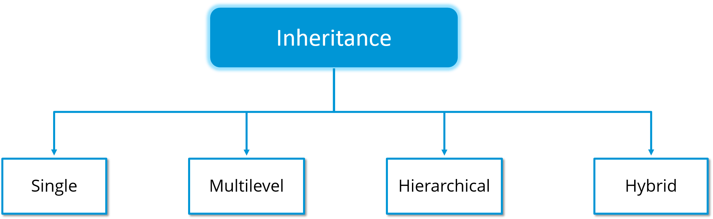

# Objects



#### **What are the benefits of Object Oriented Programming?**

1. Improved productivity during software development&#x20;
2. Improved software maintainability
3. Faster development sprints
4. Lower cost of development
5. Higher quality software

#### **However, there are a few challenges associated with OOP, namely:**

1. Steep learning curve
2. Larger program size
3. Slower program execution
4. Its not a one-size fits all solution

#### Let’s understand more about each of them in the following sequence



### **Object Oriented Programming : Inheritance**

In OOP, computer programs are designed in such a way where everything is an object that interact with one another. \
Inheritance is one such concept where the properties of one class can be inherited by the other. It helps to reuse the code and establish a relationship between different classes.\
\
As we can see in the image, a child inherits the properties from his father. Similarly, in Java, there are two classes:

<figure><figcaption></figcaption></figure>

1\. Parent class ( Super or Base class)

2\. Child class (Subclass or Derived class )

A class which inherits the properties is known as Child Class whereas a class whose properties are inherited is known as Parent class. &#x20;

#### Inheritance is further classified into 4 types:

<figure><figcaption></figcaption></figure>















